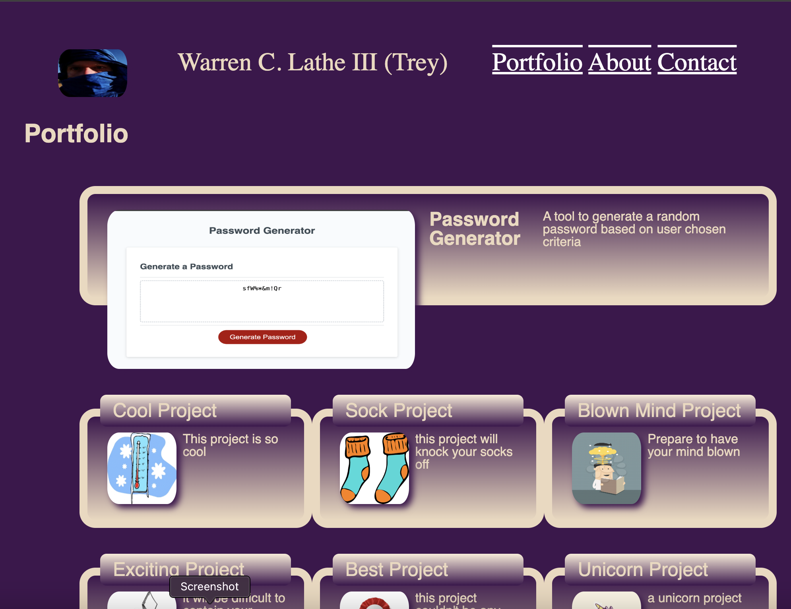
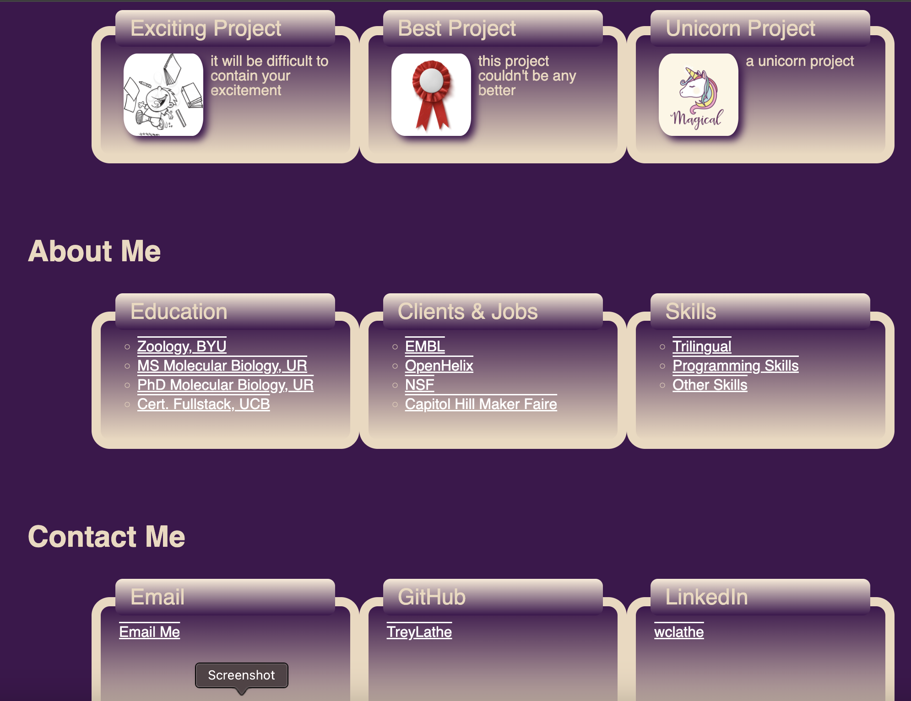

# mod-2-challenge

CHALLENGE GOAL:
This is the submission for the Portfolio challenge (challenge 2) for the full stack coding bootcamp (December 11, 2023-March 13, 2024). 

The goal of the challenge is to create and deploy a portfolio of work samples with an about section and contact info for potential employers ot assess work. 

RESOURCES USED:
*Class instruction and office hours
*Pertinent MDN and W3 sections

RELEVANT LINKS:
Repository: https://github.com/TreyLathe/mod-2-challenge
Deployed Site: https://treylathe.github.io/mod-2-challenge/

SCREENSHOTS:

COMMENTS:
Work done to fit the acceptance criteria:

WHEN I load their portfolio
THEN I am presented with the developer's name, a recent photo or avatar, and links to sections about them, their work, and how to contact them

**All these are included. 

WHEN I click one of the links in the navigation
THEN the UI scrolls to the corresponding section

<!-- **Navigation links in header take viewer to cooresponding section -->

WHEN I click on the link to the section about their work
THEN the UI scrolls to a section with titled images of the developer's applications

<!-- **Titled images are currently place holders, need to be replaced with original or royaltyfree if not . -->

WHEN I am presented with the developer's first application
THEN that application's image should be larger in size than the others

<!-- **The first application uses a larger (full screen width) box with larger image -->

WHEN I click on the images of the applications
THEN I am taken to that deployed application

<!-- **Currently, first application links to Password Generator created later. ) -->

WHEN I resize the page or view the site on various screens and devices
THEN I am presented with a responsive layout that adapts to my viewport

<!-- ** size initially designed for phone screens, with media screen change for larger screens. Need further changes to have it fit better in mobile devices. CUrrently not working as hoped.  -->